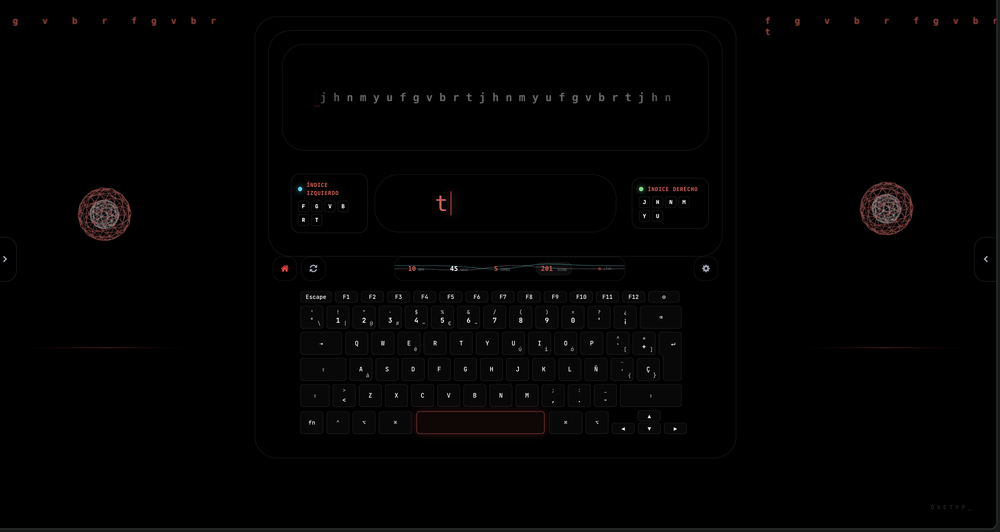

<div align="center">
  
  <h1>OveTyp_</h1>
  <p><strong>La Experiencia Cinematográfica de Mecanografía</strong></p>
  <p><i>Biomecánica · Audio-Reactividad · Elegancia Minimalista</i></p>
  
  [Leer en Inglés](README.md) | [Español]
</div>

---

## 💎 La Filosofía

**OveTyp_** no es solo un test de velocidad; es un ecosistema de entrenamiento profesional diseñado para el flujo cognitivo profundo (Deep Work). Al fusionar retroalimentación auditiva de alta fidelidad con un motor visual basado en física, transforma la práctica en una interpretación cinematográfica.

## ⚡ Pilares Fundamentales

### 🧬 Precisión Biomecánica
*   **Entrenamiento Dirigido**: Niveles dedicados a zonas específicas de los dedos (Índice, Corazón, Anular, Meñique).
*   **Guías en Tiempo Real**: Superposición dinámica de mapeo de dedos para corregir la postura y la memoria muscular.
*   **Latencia Ultra-Baja**: Motor de escritura síncrono con tiempos de respuesta sub-16ms para una respuesta instantánea.

### 🎵 Inmersión Auditiva
*   **Estilos Musicales Procedurales**: Elige entre Berlín Techno, Cyber Ambient o Acid House 303.
*   **Física Audio-Reactiva**: La interfaz "respira" con tu ritmo. Componentes como la `MorphSphere` y la `WordCurtain` vibran y rebotan en sincronía con las bandas de frecuencia de la música.

### 🏗️ Excelencia en Ingeniería
*   **Arquitectura Hexagonal**: Código desacoplado que separa el Dominio (Lógica de escritura) de la Infraestructura (React/Web Audio).
*   **Protocolo GHS**: Estándar Git History integrado para una trazabilidad profunda y mantenimiento asistido por IA.
*   **Multiplataforma**: Construido sobre **Vite** y **React**, preparado para integración de escritorio.

---

## 📸 Experiencia Visual

### Gameplay Cinematográfico
Vive la música sincronizada y los visuales basados en física. Cada palabra que escribes correctamente añade una nueva capa a la partitura.


### Modo de Entrenamiento
Zonas dedicadas para dedos específicos con guías posturales en tiempo Real y enfoque por zonas.



## 🏆 Maestría de Niveles

Progresa a través de un sistema de desafíos diseñado para construir una velocidad estructural:

| Nivel | Estrellas | Enfoque | Descripción |
| :--- | :--- | :--- | :--- |
| **Novato** | ★ | Home Row y Pares | Enfoque en posición básica y pares de alta frecuencia. |
| **Experto** | ★★ | Cadenas Complejas | Estructuras de palabras avanzadas y transiciones multi-dedo. |
| **Maestro** | ★★★ | Teclado Completo | Flujo de alta velocidad con caracteres especiales y biomecánica compleja. |

## 🚀 Primeros Pasos

### Prerrequisitos

- **Node.js**: (Se recomienda la versión LTS)
- **NPM** o **Yarn**

### Instalación

1. **Clona la experiencia**:
   ```bash
   git clone https://github.com/JoelBeja2000/OveTyp_.git
   cd OveTyp_
   ```

2. **Inicializa el motor**:
   ```bash
   npm install
   ```

3. **Lanzamiento**:
   ```bash
   npm run dev
   ```

---

<div align="center">
  <p>Desarrollado con un enfoque en el trabajo profundo y la precisión estructural.</p>
  <p><b>OVETYP_ © 2026</b></p>
</div>