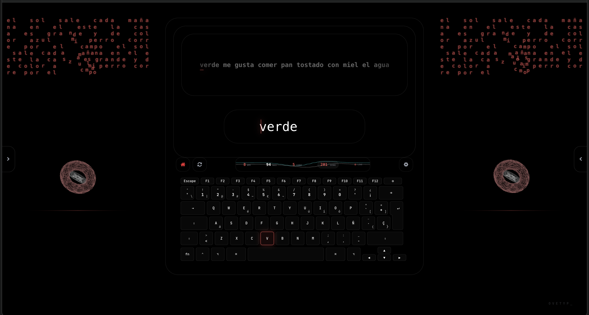
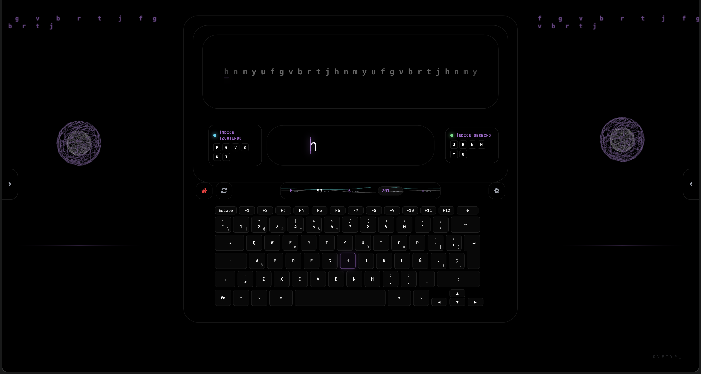

  
  <h1>OveTyp_</h1>
  
<b>A dynamic typing experience where music evolves with your accuracy.</b>

  
  [English] | [Leer en Español](README.es.md)

---

## 🎹 Overview
OveTyp_ is a simple keyboard application designed to make typing practice more engaging. As you type correctly and hit words, electronic instruments are progressively added to the background track, creating a synchronized musical performance.

## ✨ Key Features
- **Instrumental Discovery**: Maintain your rhythm to unlock new layers of electronic music in real-time.
- **Practice Mode**: Dedicated levels focused on specific keyboard zones (Indices, Medios, Anulares, Meñiques).
- **Audio-Reactive Visuals**: A 3D MorphSphere that reacts to music frequency bands and your typing speed.

## 🛠️ Tech Stack
Built for performance and scalability:
- **Core**: React 18 & TypeScript
- **Build Tool**: Vite
- **Graphics**: Three.js (WebGL) & Web Workers for physics
- **Audio**: Web Audio API (Procedural track layering)
- **Automation & Tools**: Python (Custom scripts for asset generation & GHS maintenance)
- **Architecture**: Modular logic following Hexagonal principles

## 📸 Visuals

## 🚀 Getting Started
1. `npm install`
2. `npm run dev`

---

  
<b>OVETYP_ © 2026</b>

