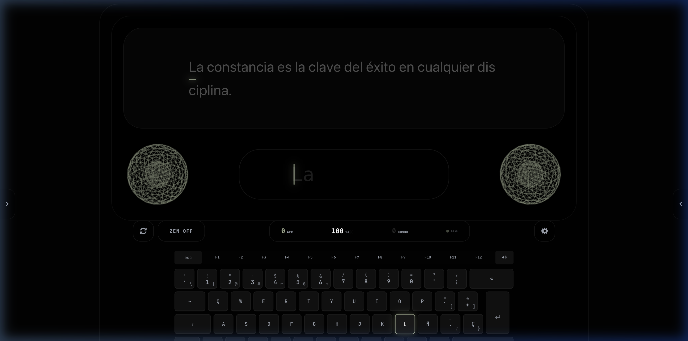
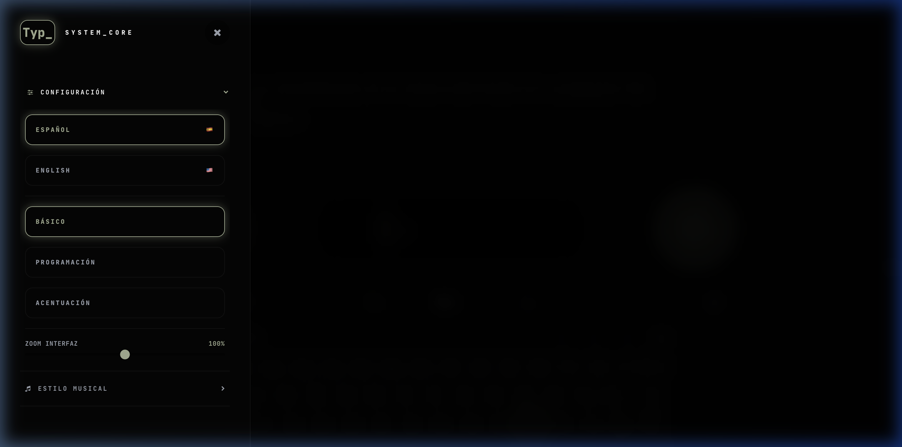

# Typ_ (Type Master)

**Typ_** is a professional-grade typing trainer designed for efficiency, speed, and precision. Built with a focus on biomechanics and auditory feedback, it provides a cinematic training experience for developers and typing enthusiasts.



## Core Features

- **Technical Training**: Specialized phases for strict finger coordination and muscle memory.
- **Biomechanical Guides**: Visual representation of finger-to-key mapping.
- **Cinematic Feedback**: Real-time auditory and visual feedback (WPM, Accuracy, Combo systems).
- **Customizable Experience**: Multiple focus modes (Basic, Programming, Accents), UI scaling, and curated color palettes.
- **Multilingual Support**: Training sets in English and Spanish.

## Visual Demo


## Project Structure

### Configuration & Customization

Easily switch between languages, focus modes, and visual styles to suit your training environment.

### Technical Training

Follow structured phases from basic finger pairs to advanced combinations and pangrams.

## Getting Started

### Prerequisites

- **Node.js**: Required to run the Vite development server.
- **Git**: For version control.

### Installation

1. **Clone the repository**:
   ```bash
   git clone https://github.com/JoelBeja2000/Typ_.git
   cd Typ_
   ```

2. **Install dependencies**:
   ```bash
   npm install
   ```

3. **Set up environment variables**:
   Create a `.env.local` file and add your `GEMINI_API_KEY`:
   ```bash
   GEMINI_API_KEY=your_api_key_here
   ```

4. **Run the application**:
   ```bash
   npm run dev
   ```

## Development

Built with:
- **Tauri**: For cross-platform desktop integration.
- **React**: For the user interface.
- **Web Audio API**: For low-latency auditory feedback.
- **Gemini AI**: For dynamic practice phrase generation.

---

*ALPINE_ECODECOR_PRO // 2025*
