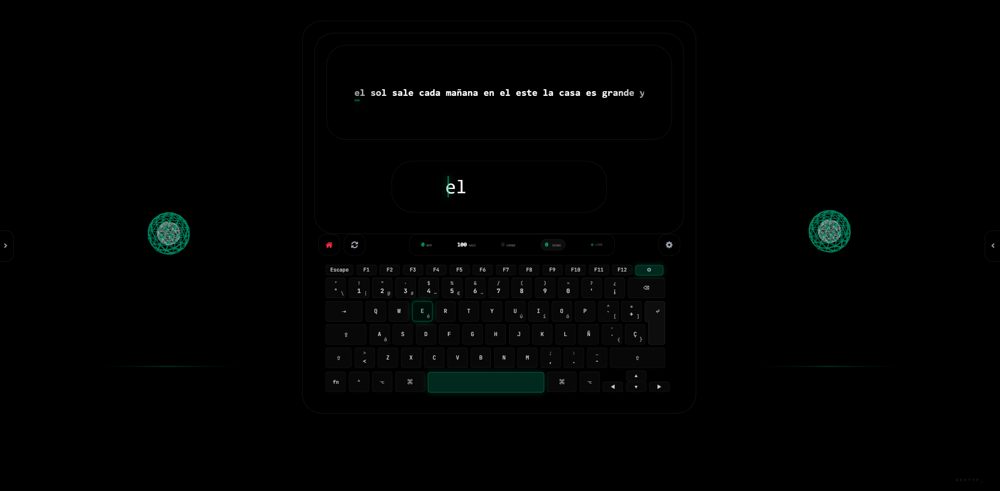

[Leer en Español](README.es.md)

# OveTyp_ (Type Master)

**OveTyp_** is a professional-grade typing trainer designed for efficiency, speed, and precision. Built with a focus on biomechanics and auditory feedback, it provides a cinematic training experience for developers and typing enthusiasts.



## Core Features

- **Hexagonal Architecture**: Strict separation of concerns (Domain, Ports, Infrastructure).
- **Ultra-Low Latency**: Synchronous typing engine providing sub-16ms response times.
- **Star-Based Levels**: Progressive difficulty from Novato (1★) → Experto (2★) → Maestro (3★).
- **Finger Practice**: Dedicated training for each finger (Índice, Corazón, Anular, Meñique).
- **Music Styles**: Dynamic audio feedback (Berlín Techno, Cyber Ambient, Acid House 303).
- **Biomechanical Guides**: Visual finger-to-key mapping.
- **Cinematic Feedback**: Real-time WPM, Accuracy, Combo systems.
- **Day/Night Mode**: Switch between light and dark themes.
- **Progress Tracking**: Shows percentage and stats when level completed.
- **GHS Integrated**: Git History Standard for AI agent context.

## New Level System

### Star Levels (Challenges)
- **Novato** (1★): Basic finger pairs
- **Experto** (2★): Advanced combinations  
- **Maestro** (3★): Full keyboard mastery

### Finger Practice
- **Índice**: F, G, V, B, R, T, J, H, N, M...
- **Corazón**: D, E, C, K, I
- **Anular**: S, W, X, L, O
- **Meñique**: A, Q, Z, Ñ, P

## Getting Started

### Prerequisites

- **Node.js**: Required to run the Vite development server.
- **Git**: For version control.

### Installation

1. **Clone the repository**:
   ```bash
   git clone https://github.com/JoelBeja2000/OveTyp_.git
   cd OveTyp_
   ```

2. **Install dependencies**:
   ```bash
   npm install
   ```

3. **Run the application**:
   ```bash
   npm run dev
   ```

### GHS Setup (Optional)

For AI agent context, set up Git History Standard:

```bash
source .venv/bin/activate
python3 tools/search.py "your query"     # Search codebase
python3 tools/indexer.py              # Re-index after changes
```

## Development

Built with:
- **Tauri**: Cross-platform desktop integration.
- **React**: User interface.
- **Web Audio API**: Low-latency auditory feedback.
- **GitHub Copilot CLI**: AI-assisted development.
